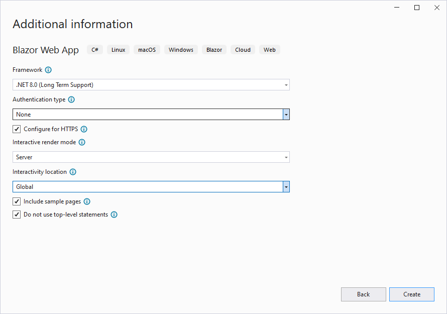

# BlazorAuthWtf

This project started as an attempt to understand how auth works in Blazor by writing a minimal implementation from scratch. It's based on the .NET 8 Blazor Web App template with these settings:

If you run this app, everything seems to work perfectly. The Weather page is protected with `[Authorize]` and cannot be loaded because the dummy `AuthenticationStateProvider` returns a user that is not logged in.

But there's a bug lurking. If the first page loaded in a circuit has `[Authorize]`, you'll get an error about the app not being able to find an `IAuthenticationService`. You can see this error by navigating to the Weather page, copying the URL, and pasting it into a new browser tab.

What. The. Fuck.

There is no such problem with the first page loaded in a circuit having an `<AuthorizeView>`.